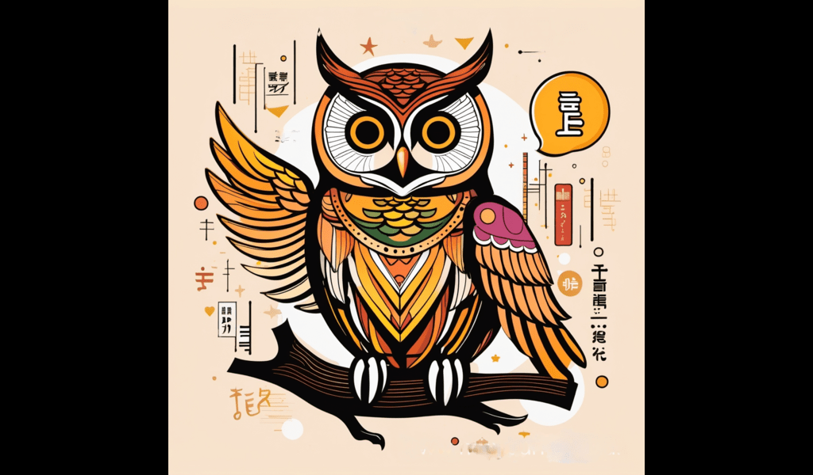

<div align='center'>


<h1>Voice chat bot and Japanese Instructor</h1>
<p>Welcome to my Voice Chat Bot project! Powered by OpenAI's Whisper and ChatGPT technologies.</p>

<h4> <span> · </span> <a href="https://github.com/AdicOnGit/VoiceChatBot/blob/master/README.md"> Documentation </a> <span> · </span> <a href="https://github.com/AdicOnGit/VoiceChatBot/issues"> Report Bug </a> <span> · </span> <a href="https://github.com/AdicOnGit/VoiceChatBot/issues"> Request Feature </a> </h4>

</div>

# :notebook_with_decorative_cover: Table of Contents

- [About the Project](#star2-about-the-project)
- [Roadmap](#compass-roadmap)
- [Contributing](#wave-contributing)

## :star2: About the Project

<p>VoiceChatBot serves as both a multilingual interaction platform and a Japanese language teaching assistant. Features: Voice Recognition with Whisper: The bot is capable of transcribing user speech into text using the Whisper C/C++ implementation. Multilingual Interaction: By leveraging a reverse API from a website that employs ChatGPT, the bot understands and interacts in multiple languages. Text-to-Speech: The responses from ChatGPT are converted to speech using the gTTS (Google Text-to-Speech) library in Python. Japanese Language Teaching: The bot is designed to teach common Japanese words and phrases, focusing on conversational fluency. This is done by scraping common words and instructing ChatGPT to deliver them in a conversational style. Project Structure: Whisper Integration: Transcribes user speech to text. Chat API Connection: Sends transcribed text along with custom instructions to the ChatGPT API. gTTS Integration: Converts ChatGPT text responses to audible speech. Japanese Language Scraper: Regularly updates a list of common Japanese words and phrases for the teaching module.Whether you're looking to have a general conversation in a language of your choice or looking to learn Japanese, my bot is here to assist.</p>

## :toolbox: Getting Started

### :running: Run Locally

Clone the project

```bash
https://github.com/AdicOnGit/VoiceChatBot/tree/master
```

Clone the project

```bash
https://github.com/AdicOnGit/VoiceChatBot/tree/master
```

Install dependencies

```bash
pip install -r requirements.txt
```

Start the program

```bash
python main.py
```

## :compass: Roadmap

- [ ] enhancing the accuracy of voice recognition.
- [ ] Expanding the vocabulary of the Japanese teaching module.
- [ ] integrating interactive exercises for a more immersive learning experience.

## :wave: Contributing

<a href="https://github.com/AdicOnGit/VoiceChatBot/tree/master/graphs/contributors">  </a>

Contributions are always welcome!

see `contributing.md` for ways to get started
